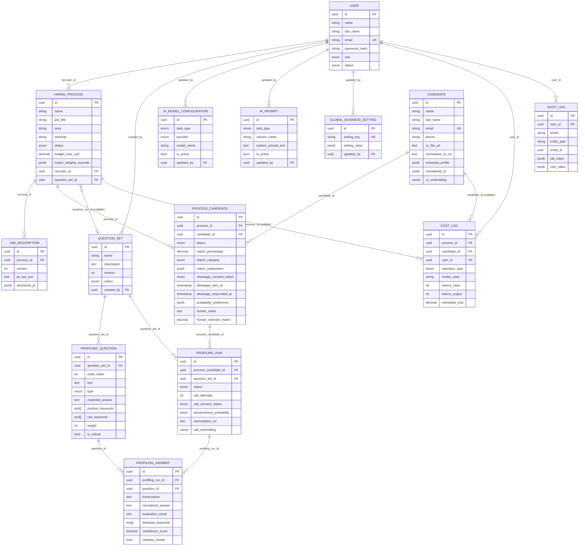

# cv-match-api

Backend de **RIWI Match**: una API que recibe CVs, los interpreta con IA, los compara contra una vacante (Job Description), gestiona el consentimiento del candidato por WhatsApp, y (en construcción) hace profiling por voz automatizado antes de pasar el candidato a un reclutador humano.

Stack: **FastAPI** (async) + **Celery** (workers) + **PostgreSQL** (con `pgvector`) + **Redis** (broker/cache) + **OpenAI** (extracción/matching/agente conversacional) + **Cloudflare R2** (storage de archivos) + **Meta WhatsApp Business API**.

---

## 1. Descripción General

RIWI Match automatiza el embudo inicial de reclutamiento:

1. Un reclutador crea un **proceso de contratación** (`HiringProcess`) con una **Job Description**.
2. Sube uno o varios **CVs** (PDF, DOCX o imágenes).
3. Un worker de Celery extrae el perfil del candidato con GPT-4o (visión), lo normaliza a un PDF con estilo propio, y dispara automáticamente el matching.
4. Otro worker calcula un **score de match** (0–100) contra la JD y categoriza al candidato (`HIGH` / `MEDIUM` / `LOW` / `NOT_RECOMMENDED`).
5. Se envía una plantilla de **WhatsApp** pidiendo consentimiento para una llamada de voz. Un agente de IA (GPT-4o) interpreta las respuestas del candidato (texto libre o clic de botón) y actualiza su estado.
6. *(Fase futura, no implementada aún)*: si el candidato consiente, se dispara una llamada de voz automatizada (ElevenLabs) que hace preguntas de un `QuestionSet`, transcribe y evalúa las respuestas para calcular una probabilidad de avance.
7. El reclutador revisa todo desde el frontend [`riwi-match`](../riwi-match/README.md).

Este backend sigue una arquitectura por capas (`domain` / `application` / `infrastructure` / `api`) inspirada en Clean Architecture, con dos máquinas de estado explícitas (`CandidateStatus` y `ProcessStatus`) y reglas de negocio documentadas (`RB-001`..`RB-010`).

---

## 2. En qué fase está el proyecto

| Fase | Estado | Qué incluye |
|---|---|---|
| **0 — Fundaciones** | ✅ Completa | Auth (JWT + refresh tokens), CRUD de procesos, modelos de BD, migraciones Alembic |
| **1 — Ingesta y parseo de CVs** | ✅ Completa | Upload multi-formato (PDF/DOCX/imágenes), extracción con GPT-4o vision, normalización a PDF (`pdf_renderer.py`), storage en R2 |
| **2 — Matching por IA** | ✅ Completa | Scoring contra JD, categorización HIGH/MEDIUM/LOW, `CostLog` por operación, encadenado automático parse → match |
| **3 — Consentimiento por WhatsApp** | 🔶 En curso | Webhook de Meta, agente conversacional GPT-4o, botones de plantilla, envío individual/masivo desde el frontend. **Bloqueado parcialmente**: la plantilla real `autorizacion_llamada_ia_v2` está pendiente de aprobación en Meta; hay un fallback temporal (`WHATSAPP_TEMPLATE_FALLBACK_ENABLED`) que envía la plantilla de muestra `hello_world` mientras tanto |
| **4 — Profiling por voz** | ⬜ No iniciada | Los modelos de datos ya existen (`ProfilingRun`, `ProfilingAnswer`, `QuestionSet`, `ProfilingQuestion`) y el CRUD de question sets funciona, pero no hay integración real con ElevenLabs ni lógica de evaluación de respuestas. `application/profiling/` está vacío |
| **5 — Settings / Métricas reales** | ⬜ No iniciada | El frontend ya tiene páginas de UI completas para esto, pero el backend no expone esos endpoints todavía (`settingsApi` y `metricsApi.getDashboard` en el frontend son 100% mock) |

**Fase actual de trabajo activo:** cerrar la integración de WhatsApp (esperando aprobación de Meta) y terminar de conectar el frontend (envío individual + masivo ya implementados).

---

## 3. Instalación y Ejecución

### Requisitos
- Python 3.12+
- PostgreSQL con extensión `pgvector` (se usa Supabase en este proyecto)
- Redis (se usa Upstash, con TLS `rediss://`)
- Cuenta de Cloudflare R2, OpenAI, y Meta for Developers (WhatsApp Business)

### Setup

```bash
# 1. Crear entorno virtual
python -m venv .venv
.venv\Scripts\activate          # Windows
# source .venv/bin/activate     # Linux/Mac

# 2. Instalar dependencias
.venv\Scripts\python.exe -m pip install -e .

# 3. Copiar y completar variables de entorno
copy .env.example .env          # Windows
# cp .env.example .env          # Linux/Mac
# Edita .env con tus credenciales reales (ver sección de Variables de Entorno abajo)

# 4. Correr migraciones
.venv\Scripts\alembic.exe upgrade head

# 5. Levantar el servidor API
.venv\Scripts\uvicorn.exe src.api.main:app --reload --port 8000

# 6. En OTRA terminal, levantar el worker de Celery (obligatorio para CVs, match y WhatsApp)
.venv\Scripts\celery.exe -A src.infrastructure.workers.celery_app worker --loglevel=info --pool=solo
```

> `--pool=solo` es obligatorio en Windows con Python 3.13 (Celery no soporta bien `prefork`/`gevent` ahí). Ver [`start_dev.bat`](start_dev.bat) para un script que levanta ambos procesos de una vez.

### Variables de entorno clave (ver `.env.example` y `src/config.py`)

| Variable | Requerida | Descripción |
|---|---|---|
| `DATABASE_URL` / `DATABASE_URL_SYNC` | Sí | Postgres async (asyncpg) y sync (psycopg2, usado por Celery) |
| `REDIS_URL` | No (default local) | Broker/backend de Celery, soporta `rediss://` con TLS |
| `R2_ACCOUNT_ID` / `R2_ACCESS_KEY_ID` / `R2_SECRET_ACCESS_KEY` / `R2_BUCKET_NAME` | Sí (para CVs) | Storage S3-compatible de Cloudflare |
| `OPENAI_API_KEY` | Sí | Extracción de CV, matching, agente de WhatsApp |
| `META_WHATSAPP_PHONE_NUMBER_ID` / `META_WHATSAPP_ACCESS_TOKEN` | Sí (para WhatsApp) | Credenciales de la app de Meta for Developers |
| `META_WHATSAPP_VERIFY_TOKEN` / `META_WHATSAPP_WEBHOOK_SECRET` | Sí (para webhook) | Verificación de suscripción y validación HMAC de payloads entrantes |
| `WHATSAPP_TEMPLATE_FALLBACK_ENABLED` | No (default `false`) | Si `true`, envía `hello_world` en vez de la plantilla real (mientras Meta la aprueba) |
| `MAX_CONCURRENT_CALLS` / `WHATSAPP_CONSENT_TIMEOUT_HOURS` / `CV_BATCH_LIMIT` | No | Reglas de negocio configurables (RB-005 y límites operativos) |

### Scripts útiles (`scripts/`)

| Script | Qué hace |
|---|---|
| `create_admin.py` | Crea un usuario `ADMIN` interactivo (pide nombre/email/password por consola) |
| `create_recruiter.py` | Crea el recruiter de prueba fijo `recruiter@riwi.io` / `riwi2026` |
| `seed_test_data.py` | Crea un proceso completo con 4 CVs de candidatos ficticios y dispara el matching end-to-end contra la API corriendo. **Nota:** usa rutas (`/api/v1/processes/` con slash final, `/api/v1/match/{id}/run`) que ya no coinciden con los routers actuales (`processes.py` sin slash final, `match.py` con `POST /processes/{id}/match`) — revisar antes de usar |
| `seed_test_candidates.py` | Crea un proceso con candidatos de prueba reales (nombre + teléfono) para probar el flujo de WhatsApp end-to-end |
| `test_whatsapp.py` | Crea datos de prueba y envía la plantilla de consentimiento real a un número dado por argumento |
| `reset_and_verify.py` | Utilidad de reset/verificación de datos (revisar antes de correr en una BD con datos reales) |

---

## 4. Usuarios de Prueba

| Rol | Email | Password | Cómo se crea |
|---|---|---|---|
| Recruiter | `recruiter@riwi.io` | `riwi2026` | `python scripts/create_recruiter.py` (idempotente, no falla si ya existe) |
| Admin | El que tú definas | El que tú definas | `python scripts/create_admin.py` (interactivo) |
| Recruiter de debug | `recruiter-test@riwi.io` | `test1234` | Se crea automáticamente al llamar `POST /api/v1/debug/seed-whatsapp-test` o correr `scripts/seed_test_candidates.py` (solo si `APP_ENV=development`) |

No hay usuarios "candidato" con login — los candidatos no acceden al sistema, solo reciben WhatsApp.

---

## 5. Tecnologías Utilizadas (patrones y conceptos aplicados)

- **FastAPI** — API async, `Depends()` para inyección de sesión de BD y autenticación, `exception_handler` por tipo de excepción de dominio.
- **SQLAlchemy 2.0 (async)** — ORM con `Mapped[...]` typing, `selectinload` para evitar N+1, `AsyncSession`.
- **Alembic** — migraciones versionadas (`alembic/versions/`).
- **Celery + Redis** — procesamiento asíncrono pesado (parseo de CV con visión, matching con IA, envío de WhatsApp) desacoplado del request HTTP.
- **Clean Architecture / DDD por capas**:
  - `domain/` — lógica de negocio pura (máquinas de estado, reglas RB-00X, value objects), sin dependencias de infraestructura.
  - `application/` — casos de uso que orquestan domain + infrastructure (parcialmente implementado, ver Decisiones Arquitectónicas).
  - `infrastructure/` — detalles técnicos: BD, storage (R2), mensajería (WhatsApp), workers, auth.
  - `api/` — capa de presentación HTTP (routers, deps, exception handling).
- **State Machines explícitas** (`CandidateStatus`, `ProcessStatus`) — cada transición se valida contra un diccionario de transiciones permitidas; transición inválida lanza `BusinessRuleException` → HTTP 422.
- **Value Objects** — `MatchWeights`, `AdvancementProbability`, validan invariantes en su propio constructor.
- **Repository Pattern** — `CandidateRepository`, `ProcessRepository`, `UserRepository` encapsulan queries de SQLAlchemy.
- **Multimodal LLM (GPT-4o vision)** — extracción de CVs directamente de imágenes/PDFs renderizados sin OCR intermedio.
- **Agente conversacional con clasificación de intención** — el mensaje de WhatsApp se clasifica en `ACCEPTED` / `REJECTED` / `QUESTION` / `AVAILABILITY_ONLY` vía prompt estructurado con salida JSON forzada (`response_format={"type": "json_object"}`).
- **pgvector** — columnas `Vector(1536)` en `Candidate.cv_embedding` y `ProfilingRun.call_embedding` (preparadas para búsqueda semántica, aún no explotadas por ningún endpoint).
- **Presigned URLs (S3/R2)** — descargas de CVs y JDs vía URL firmada de 1 hora en vez de proxyear el archivo.
- **HMAC signature validation** — el webhook de WhatsApp valida `X-Hub-Signature-256` contra `META_WHATSAPP_WEBHOOK_SECRET` en producción.

---

## 6. Estructura Completa de Archivos

```
cv-match-api/
├── src/
│   ├── config.py                          # Settings (pydantic-settings), lee .env
│   ├── api/
│   │   ├── main.py                        # App FastAPI, CORS, exception handlers, registro de routers
│   │   ├── deps.py                         # get_current_user, require_role(), RequireAdmin/RequireRecruiter/...
│   │   └── v1/
│   │       ├── auth.py                    # POST /login /refresh /logout
│   │       ├── processes.py               # CRUD de procesos + Job Description
│   │       ├── candidates.py               # Listado, detalle, override, descarga CV, envío WhatsApp
│   │       ├── match.py                    # Trigger de match + estado de progreso
│   │       ├── question_sets.py            # CRUD de sets de preguntas de profiling
│   │       ├── webhooks.py                 # Webhook de Meta WhatsApp (GET verify / POST mensajes)
│   │       └── debug.py                    # Endpoints solo-dev para sembrar/simular WhatsApp
│   ├── application/
│   │   ├── auth/use_cases.py               # LoginUseCase, RefreshTokenUseCase, LogoutUseCase
│   │   ├── candidate/whatsapp_message_usecase.py   # Interpreta mensajes entrantes de WhatsApp
│   │   ├── cv/use_cases.py                 # UploadCVsUseCase
│   │   └── hiring_process/ match/ profiling/        # Vacíos — casos de uso viven hoy en api/v1/*.py
│   ├── domain/
│   │   ├── shared/exceptions.py            # DomainException y subclases → mapeadas a HTTP
│   │   ├── candidate/state_machine.py      # Transiciones válidas de CandidateStatus
│   │   ├── hiring_process/state_machine.py # Transiciones válidas de ProcessStatus
│   │   ├── hiring_process/rules.py         # RB-001 a RB-010
│   │   ├── match/value_objects.py          # MatchWeights
│   │   └── profiling/value_objects.py      # AdvancementProbability (RB-006/RB-007)
│   └── infrastructure/
│       ├── db/
│       │   ├── database.py                 # engine async, AsyncSessionFactory, Base
│       │   ├── models.py                   # Todas las tablas + Enums
│       │   └── repositories/               # candidate_repository.py, process_repository.py, user_repository.py
│       ├── auth/
│       │   ├── tokens.py                   # JWT encode/decode
│       │   ├── refresh_tokens.py           # Gestión de refresh tokens en Redis
│       │   └── password.py                 # hash_password / verify_password (bcrypt)
│       ├── storage/r2_client.py            # Upload/download/presigned URL en Cloudflare R2
│       ├── messaging/whatsapp_client.py    # Cliente HTTP hacia Graph API de Meta
│       ├── ai/prompts.py                   # Prompts de extracción/matching
│       ├── cv/pdf_renderer.py              # Renderiza el CV normalizado (estilo BBLABS)
│       └── workers/
│           ├── celery_app.py               # Config de Celery (broker/backend Redis, TZ Bogotá)
│           └── tasks/
│               ├── parse_cv.py             # Extrae perfil con GPT-4o vision → dispara match + WhatsApp
│               ├── run_match.py            # Calcula score/categoría contra la JD
│               └── whatsapp.py             # Envía la plantilla de consentimiento
├── alembic/
│   ├── env.py
│   └── versions/                           # 3 migraciones: schema inicial, normalized_cv_url, campos whatsapp
├── scripts/                                # create_admin.py, create_recruiter.py, seed_test_data.py,
│                                            # seed_test_candidates.py, test_whatsapp.py, reset_and_verify.py
├── tests/
│   ├── unit/domain/                        # Vacío — sin tests reales todavía
│   └── integration/                        # Vacío
├── pyproject.toml                          # Dependencias y config de ruff/mypy/pytest
├── alembic.ini
├── .env.example
└── start_dev.bat                           # Levanta uvicorn + celery worker en ventanas separadas (Windows)
```

---

## 7. Funcionalidades y Dónde Encontrar el Código

| Funcionalidad | Endpoint(s) | Código clave |
|---|---|---|
| Login / refresh / logout | `POST /api/v1/auth/{login,refresh,logout}` | [`src/api/v1/auth.py`](src/api/v1/auth.py), [`src/application/auth/use_cases.py`](src/application/auth/use_cases.py) |
| Crear proceso de contratación | `POST /api/v1/processes` | [`src/api/v1/processes.py`](src/api/v1/processes.py) |
| Subir Job Description (texto o archivo) | `POST /api/v1/processes/{id}/job-description[/upload]` | [`src/api/v1/processes.py`](src/api/v1/processes.py) |
| Subir CVs (multi-formato) | `POST /api/v1/processes/{id}/candidates/upload` | [`src/application/cv/use_cases.py`](src/application/cv/use_cases.py) |
| Extracción de perfil con IA | (worker, no HTTP) | [`src/infrastructure/workers/tasks/parse_cv.py`](src/infrastructure/workers/tasks/parse_cv.py) |
| Normalización de CV a PDF | (dentro de `parse_cv`) | [`src/infrastructure/cv/pdf_renderer.py`](src/infrastructure/cv/pdf_renderer.py) |
| Matching contra la JD | `POST /api/v1/processes/{id}/match` (dispara workers) | [`src/api/v1/match.py`](src/api/v1/match.py), [`src/infrastructure/workers/tasks/run_match.py`](src/infrastructure/workers/tasks/run_match.py) |
| Listado/ranking de candidatos | `GET /api/v1/processes/{id}/candidates` | [`src/api/v1/candidates.py`](src/api/v1/candidates.py) |
| Override manual de match/notas | `PATCH /api/v1/processes/{id}/candidates/{pc_id}/override` | [`src/api/v1/candidates.py`](src/api/v1/candidates.py) |
| Descarga de CV original/normalizado | `GET .../cv/file`, `GET .../cv-normalized/file` | [`src/api/v1/candidates.py`](src/api/v1/candidates.py), [`src/infrastructure/storage/r2_client.py`](src/infrastructure/storage/r2_client.py) |
| Envío de consentimiento por WhatsApp (manual/individual) | `POST .../candidates/{pc_id}/whatsapp/send` | [`src/api/v1/candidates.py`](src/api/v1/candidates.py) |
| Envío automático tras matching | (dentro de `parse_cv`, condicional a credenciales) | [`src/infrastructure/workers/tasks/parse_cv.py`](src/infrastructure/workers/tasks/parse_cv.py) |
| Plantilla de WhatsApp (con fallback) | (worker) | [`src/infrastructure/workers/tasks/whatsapp.py`](src/infrastructure/workers/tasks/whatsapp.py), [`src/infrastructure/messaging/whatsapp_client.py`](src/infrastructure/messaging/whatsapp_client.py) |
| Webhook de Meta (verify + mensajes entrantes) | `GET/POST /api/v1/webhooks/whatsapp` | [`src/api/v1/webhooks.py`](src/api/v1/webhooks.py) |
| Agente de IA que interpreta respuestas | (usado por el webhook) | [`src/application/candidate/whatsapp_message_usecase.py`](src/application/candidate/whatsapp_message_usecase.py) |
| CRUD de question sets (profiling) | `/api/v1/question-sets/*` | [`src/api/v1/question_sets.py`](src/api/v1/question_sets.py) |
| Seed/simulación de WhatsApp (solo dev) | `/api/v1/debug/*` | [`src/api/v1/debug.py`](src/api/v1/debug.py) |
| Autenticación y roles | (dependencies) | [`src/api/deps.py`](src/api/deps.py) |
| Máquinas de estado | (validación interna) | [`src/domain/candidate/state_machine.py`](src/domain/candidate/state_machine.py), [`src/domain/hiring_process/state_machine.py`](src/domain/hiring_process/state_machine.py) |
| Reglas de negocio RB-001..RB-010 | (validación interna) | [`src/domain/hiring_process/rules.py`](src/domain/hiring_process/rules.py), [`src/domain/profiling/value_objects.py`](src/domain/profiling/value_objects.py) |

---

## 8. Documentación de Endpoints API

Todos los endpoints están bajo el prefijo `/api/v1`. Autenticación: header `Authorization: Bearer <access_token>` (JWT), salvo donde se indique. Roles: `ADMIN`, `RECRUITER`, `TA_LEADER`.

### Auth (`auth.py`)
| Método | Ruta | Body | Respuesta | Auth |
|---|---|---|---|---|
| POST | `/auth/login` | `{email, password}` | `{access_token, refresh_token, token_type, role}` | Pública |
| POST | `/auth/refresh` | `{refresh_token}` | `{access_token, refresh_token, token_type, role}` | Pública |
| POST | `/auth/logout` | `{refresh_token}` | `204` | Pública |

### Processes (`processes.py`)
| Método | Ruta | Descripción | Rol |
|---|---|---|---|
| POST | `/processes` | Crea proceso (valida pesos de match si se envían) | RECRUITER+ |
| GET | `/processes` | Lista procesos (RECRUITER ve solo los suyos) | cualquiera autenticado |
| GET | `/processes/{process_id}` | Detalle + JD activa | cualquiera autenticado |
| POST | `/processes/{process_id}/job-description` | Crea nueva versión de JD desde texto (RB-009: proceso no puede estar cerrado) | RECRUITER+ |
| POST | `/processes/{process_id}/job-description/upload` | Sube archivo de JD (PDF/DOCX/TXT, máx 10MB), extrae texto | RECRUITER+ |
| GET | `/processes/{process_id}/job-description/file` | Redirect a URL firmada (1h) | RECRUITER (token en query) |

### Candidates (`candidates.py`)
| Método | Ruta | Descripción | Rol |
|---|---|---|---|
| POST | `/processes/{id}/candidates/upload` | Sube CVs (PDF/DOCX/JPG/PNG/WEBP), crea `Candidate`+`ProcessCandidate`, encola `parse_cv` | RECRUITER+ |
| GET | `/processes/{id}/candidates` | Lista candidatos con rank, match, whatsapp_consent | autenticado |
| GET | `/processes/{id}/candidates/{pc_id}` | Detalle completo de un candidato | autenticado |
| PATCH | `/processes/{id}/candidates/{pc_id}/override` | Notas / override manual del % de match | RECRUITER+ |
| GET | `/processes/{id}/candidates/{pc_id}/cv/file` | Redirect a URL firmada del CV original | RECRUITER (query token) |
| GET | `/processes/{id}/candidates/{pc_id}/cv-normalized/file` | Redirect a URL firmada del CV normalizado | RECRUITER (query token) |
| POST | `/processes/{id}/candidates/{pc_id}/whatsapp/send` | Encola envío/reenvío de plantilla de consentimiento (bloquea si ya respondió ACCEPTED/REJECTED) | RECRUITER+ |

### Match (`match.py`)
| Método | Ruta | Descripción | Rol |
|---|---|---|---|
| POST | `/processes/{id}/match` | Encola `run_match` para candidatos en `MATCH_PENDING` (valida RB-001, RB-009) | RECRUITER+ |
| GET | `/processes/{id}/match/status` | Progreso: matched/pending/processing/errors/% | autenticado |

### Question Sets (`question_sets.py`)
| Método | Ruta | Descripción | Rol |
|---|---|---|---|
| POST | `/question-sets` | Crea set (+ preguntas opcionales) | RECRUITER+ |
| GET | `/question-sets` | Lista todos, con preguntas | autenticado |
| GET | `/question-sets/{id}` | Detalle | autenticado |
| PATCH | `/question-sets/{id}` | Edita nombre/descripción/status | RECRUITER+ |
| DELETE | `/question-sets/{id}` | Elimina | RECRUITER+ |
| POST | `/question-sets/{id}/questions` | Agrega pregunta (auto `order_index`) | RECRUITER+ |
| PATCH | `/question-sets/{id}/questions/{qid}` | Edita pregunta | RECRUITER+ |
| DELETE | `/question-sets/{id}/questions/{qid}` | Elimina pregunta | RECRUITER+ |

### Webhooks (`webhooks.py`)
| Método | Ruta | Descripción |
|---|---|---|
| GET | `/webhooks/whatsapp` | Verificación de Meta (`hub.mode`, `hub.verify_token`, `hub.challenge`) |
| POST | `/webhooks/whatsapp` | Recibe mensajes (valida firma HMAC en prod), clasifica intención y responde |

### Debug (`debug.py`, solo si `APP_ENV=development`)
| Método | Ruta | Descripción |
|---|---|---|
| POST | `/debug/seed-whatsapp-test` | Crea recruiter+proceso+candidato de prueba con teléfono dado |
| POST | `/debug/simulate-whatsapp-message` | Simula un mensaje entrante sin pasar por Meta |

### Otros
- `GET /health` — health check simple.
- Errores de dominio se mapean automáticamente: `Unauthorized→401`, `Forbidden→403`, `NotFound→404`, `Conflict→409`, `BusinessRule→422`, `Domain→400` (genérico). Todos responden `{"detail": "..."}`.

---

## 9. Diagrama Entidad-Relación



---

## 10. Máquinas de Estado y Reglas de Negocio

### `CandidateStatus` ([`state_machine.py`](src/domain/candidate/state_machine.py))
```
LOADED → CV_PROCESSING → {MATCH_PENDING, CV_ERROR}
CV_ERROR → CV_PROCESSING (reintento)
MATCH_PENDING → MATCHED
MATCHED → {SELECTED_FOR_PROFILING, DISCARDED, MATCH_PENDING}
SELECTED_FOR_PROFILING → {PROFILING_QUEUED, MATCHED}
PROFILING_QUEUED → {PROFILING_CALLING, SELECTED_FOR_PROFILING}
PROFILING_CALLING → {PROFILING_COMPLETED, PROFILING_FAILED}
PROFILING_FAILED → {PROFILING_QUEUED, DISCARDED}
PROFILING_COMPLETED → (terminal)
DISCARDED → MATCHED   # RB-008: reversible solo manualmente, nunca automático
```

### `ProcessStatus` ([`state_machine.py`](src/domain/hiring_process/state_machine.py))
```
DRAFT → CVS_UPLOADED
CVS_UPLOADED → {MATCH_PROCESSING, CVS_UPLOADED, CLOSED}
MATCH_PROCESSING → MATCH_DONE
MATCH_DONE → {PROFILING_CONFIGURED, MATCH_PROCESSING, CVS_UPLOADED, CLOSED}
PROFILING_CONFIGURED → {PROFILING_ACTIVE, MATCH_PROCESSING, CVS_UPLOADED, CLOSED}
PROFILING_ACTIVE → {PROFILING_COMPLETED, PROFILING_CONFIGURED}
PROFILING_COMPLETED → {CLOSED, PROFILING_ACTIVE}
CLOSED → ARCHIVED
ARCHIVED → (terminal)
```

### Reglas de negocio (`rules.py`, `value_objects.py`)
| Regla | Descripción | Dónde se aplica |
|---|---|---|
| RB-001 | No se puede correr match sin una Job Description activa | `hiring_process/rules.py`, `api/v1/match.py`, `run_match.py` |
| RB-002 | Un CV no procesado correctamente no puede ser rankeado | `candidate/state_machine.py`, `run_match.py` |
| RB-003 | El profiling solo se habilita si el proceso tiene un `QuestionSet` asignado | `hiring_process/rules.py` |
| RB-004 | Las llamadas de profiling requieren selección manual del reclutador (nunca automáticas) | `hiring_process/rules.py` |
| RB-005 | Límite de llamadas simultáneas configurable (`MAX_CONCURRENT_CALLS`, default 4) | `hiring_process/rules.py` |
| RB-006 | Pregunta crítica incumplida → probabilidad de avance mínimo `MEDIUM` | `profiling/value_objects.py` |
| RB-007 | Respuesta crítica incorrecta puede bajar la probabilidad a `LOW` | `profiling/value_objects.py` |
| RB-008 | Un candidato nunca se descarta automáticamente, solo manualmente | `candidate/state_machine.py` |
| RB-009 | Procesos `CLOSED`/`ARCHIVED` no permiten nuevas operaciones | `hiring_process/rules.py`, `processes.py`, `match.py` |
| RB-010 | Si el costo acumulado supera el presupuesto, se bloquean nuevas ejecuciones | `hiring_process/rules.py` |

---

## 11. Decisiones Arquitectónicas

- **Clean Architecture por capas, pero con `application/` parcialmente vacío.** Los casos de uso de `processes`, `candidates` y `match` viven hoy directamente en los routers de `api/v1/`, no en `application/hiring_process|match|profiling/` (que existen como carpetas vacías). Solo `auth`, `cv` (upload) y `candidate` (WhatsApp) tienen casos de uso extraídos de verdad. Es una inconsistencia deliberada por velocidad, pendiente de nivelar.
- **Máquinas de estado explícitas como diccionarios de transición**, no como una librería de FSM — decisión simple y fácil de auditar/testear, a costa de no tener visualización automática (por eso documentamos las transiciones a mano arriba).
- **Celery con Redis (Upstash TLS) y sesión SQLAlchemy *síncrona*** dentro de los workers, mientras la API usa sesión *async* — evita pelear con SQLAlchemy async dentro del executor de Celery, a costa de mantener dos engines (`database.py` async + `create_engine(settings.database_url_sync)` dentro de cada task).
- **Encadenado automático de tareas** (`parse_cv` → `run_match` → `send_whatsapp_consent`) en vez de una orquestación central (ej. Celery Canvas/chains) — más simple de leer pero más difícil de reintentar solo un paso del pipeline.
- **Fallback de plantilla de WhatsApp vía feature flag** (`WHATSAPP_TEMPLATE_FALLBACK_ENABLED`) en lugar de hardcodear el nombre de la plantilla — permite operar mientras Meta aprueba la plantilla real sin tocar código, solo la variable de entorno.
- **GPT-4o vision para extracción de CV** en vez de un pipeline OCR clásico — se simplifica el pipeline (no hay paso de OCR separado) a costa de mayor costo/latencia por CV; por eso existe `CostLog` desde el día uno.
- **Presigned URLs de R2** en vez de servir archivos desde el propio backend — evita cargar el proceso de FastAPI con streaming de binarios grandes.
- **Sin capa de autorización granular por objeto** (más allá de rol): un `RECRUITER` ve solo sus procesos por query filtrada, pero no hay ACL por proceso individual entre recruiters del mismo rol.

---

## 12. Errores/Bugs Conocidos

1. **`src/api/v1/debug.py` línea 93** — `Candidate(..., status=CandidateStatus.MATCHED)` usa un kwarg `status` que **no existe** en el modelo `Candidate` (el status vive en `ProcessCandidate`). Llamar a `POST /debug/seed-whatsapp-test` lanza `TypeError`. Fix: quitar ese kwarg.
2. **`scripts/seed_test_data.py`** usa rutas desactualizadas: `POST /api/v1/processes/` (con slash final) y `POST /api/v1/match/{id}/run`, que ya no coinciden con los routers actuales (`/api/v1/processes` sin slash, `POST /api/v1/processes/{id}/match`). El script probablemente falla si se corre tal cual.
3. **Variables `AZURE_DOCUMENT_INTELLIGENCE_ENDPOINT`/`KEY`** declaradas en `.env.example` pero nunca referenciadas en el código — configuración muerta.
4. **`tests/unit/` y `tests/integration/`** están vacíos pese a que `pyproject.toml` ya tiene pytest/pytest-asyncio/pytest-cov configurados — no hay ningún test real todavía.
5. **La plantilla real `autorizacion_llamada_ia_v2`** sigue pendiente de aprobación en Meta al momento de escribir esto; el flag `WHATSAPP_TEMPLATE_FALLBACK_ENABLED=true` es la mitigación temporal (envía `hello_world`).
6. **Meta bloquea el envío a números no registrados como "recipiente de prueba"** mientras la app esté en modo Development (error `#131030 Recipient phone number not in allowed list`). No es bug del código, pero rompe las pruebas con números que no sean del propio developer o no estén verificados en el panel de Meta.
7. **`src/application/hiring_process/`, `match/`, `profiling/`** están vacíos — inconsistencia con el patrón de capas declarado (ver Decisiones Arquitectónicas).
8. **`src/infrastructure/cache/`, `queue/`, `voice/`** son directorios placeholder sin contenido.
9. **CORS abierto (`allow_origins="*"`) en desarrollo** — correcto para dev, pero hay que verificar que el deployment de producción realmente fuerce la lista blanca antes de salir a producción.

---

## 13. Mejoras Futuras

- Implementar el profiling de voz real: integración con ElevenLabs (o similar) para llamadas salientes, transcripción, y evaluación automática de `ProfilingAnswer` contra `ProfilingQuestion` (positive/risk keywords, criticidad).
- Terminar la aprobación de la plantilla de WhatsApp en Meta y apagar `WHATSAPP_TEMPLATE_FALLBACK_ENABLED`.
- Manejar mejor los reintentos de Celery cuando el error de WhatsApp es "número no autorizado" (131030) — hoy reintenta 3 veces sin sentido porque reintentar no cambia el resultado; debería fallar rápido y marcar el `ProcessCandidate` de alguna forma visible en vez de solo loggear.
- Escribir la suite de tests (unit para máquinas de estado y reglas RB-00X; integración para los endpoints y el flujo de Celery).
- Mover la lógica de negocio de los routers de `api/v1/processes.py`, `candidates.py`, `match.py` hacia casos de uso reales en `application/`, para que la capa API quede delgada de verdad.
- Exponer endpoints reales de `settings` y `metrics` (el frontend ya tiene la UI construida esperando estos datos).
- Endpoint de recuperación de contraseña (el frontend ya tiene la pantalla, pero es 100% mock).
- Aprovechar las columnas `cv_embedding`/`call_embedding` (pgvector) para búsqueda semántica de candidatos, hoy declaradas pero sin ningún endpoint que las use.
- Agregar autorización más granular (ej. que un `RECRUITER` no pueda ver el proceso de otro `RECRUITER` aunque adivine el UUID).
